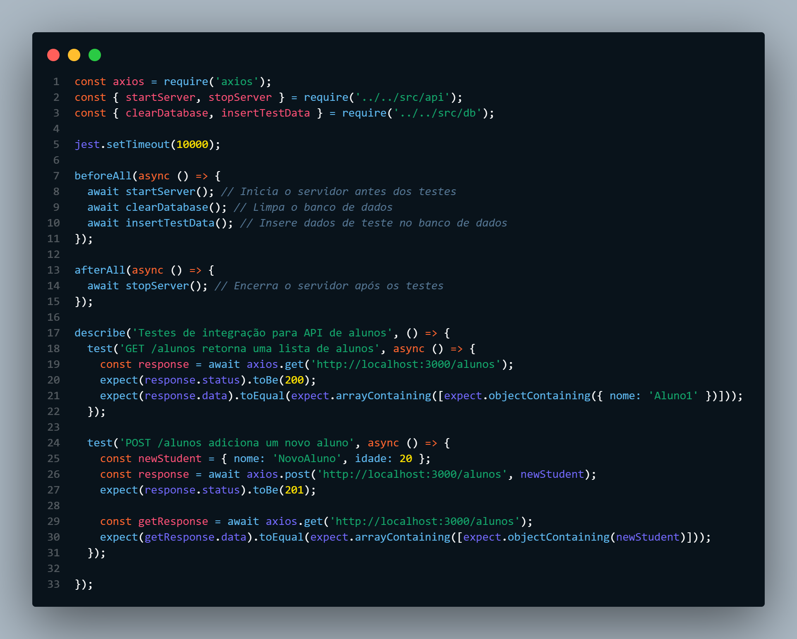

# Teste de integração para uma API utilizando TypseScript
</hr>




## Objetivo 🎯
  - Aplicando meus conhecimentos em TypeScript e Jest, para solucionar um dos maiores problemas que grandes empresas possui em relação a uma API em JS.
  - O objetivo do projeto é aumentar a performace da API deixando a mais robusta e menos propensa a erros utilizando TypeScript e Jest.


## Etapas do desenvolvimento 🖋️
1. Migração para o TypeScript
2. Configuração do Jest
3. Teste de Integração 

## Configuração e Execução dos Testes 💻
- ### Pré-requisitos
  Certifique-se de ter o Node.js e o npm instalados em sua máquina. Você pode fazer o download e instalá-los a partir do site oficial do Node.js.

- ### Instalação das Dependências
  Abra um terminal na raiz do seu projeto e execute o seguinte comando para instalar as dependências necessárias:
  ```
  npm install
  ```

- ### Configuração do Ambiente de Testes
  Certifique-se de que o arquivo de configuração ``jest.config.js`` esteja configurado corretamente. Você pode ajustar as configurações conforme necessário para atender aos requisitos específicos do seu projeto.

- ### Execução dos Testes
  Para executar os testes de integração, utilize o seguinte comando:
  ````
  npm test
  ````
